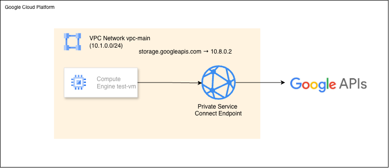

# GCP Private Service Connect

Access Google APIs through private endpoints instead of routing through the public internet.

By default, when your VMs call Google APIs (Cloud Storage, BigQuery, Pub/Sub), DNS resolves to public IP addresses like `142.250.x.x`. Private Service Connect (PSC) creates a private endpoint inside your VPC and overrides DNS so all API traffic resolves to an RFC1918 address you control — never leaving Google's network.

**What you'll build:**
- VPC with a private subnet (no external IPs on VMs)
- PSC endpoint for all Google APIs at IP `10.8.0.2`
- Cloud DNS private zone that overrides `*.googleapis.com` to return `10.8.0.2`
- Test VM with a service account (`test-vm-sa`) that has `roles/storage.objectViewer`
- Cloud NAT (for VM startup script to install packages)

## Architecture



## Prerequisites

- GCP account with billing enabled
- `gcloud` CLI installed and authenticated
- Terraform >= 1.0

## Deploy

### Step 1: Clone the Repo

```bash
git clone https://github.com/misskecupbung/gcp-private-service-connect.git
cd gcp-private-service-connect
```

### Step 2: Enable APIs

```bash
export PROJECT_ID="your-project-id"
gcloud config set project $PROJECT_ID

gcloud services enable compute.googleapis.com
gcloud services enable dns.googleapis.com
gcloud services enable storage.googleapis.com
gcloud services enable iam.googleapis.com
gcloud services enable cloudresourcemanager.googleapis.com
gcloud services enable iap.googleapis.com
```

### Step 3: Deploy with Terraform

```bash
cd terraform

cp terraform.tfvars.example terraform.tfvars
sed -i "s/your-project-id/$PROJECT_ID/" terraform.tfvars

# Deploy
terraform init
terraform plan
terraform apply
```

Terraform creates:
- 1 VPC with subnet (`10.1.0.0/24`)
- 1 test VM with no external IP
- Service account `test-vm-sa` with `roles/storage.objectViewer`
- Cloud Router + Cloud NAT (for startup script package installation)
- PSC global address (`10.8.0.2`) and global forwarding rule targeting `all-apis`
- Cloud DNS private zone with A records for `*.googleapis.com` → `10.8.0.2`
- Firewall rules for IAP SSH

### Step 4: Create a Test Bucket

```bash
gsutil mb -l us-central1 gs://$PROJECT_ID-psc-test
echo "Hello from Private Service Connect" > test.txt
gsutil cp test.txt gs://$PROJECT_ID-psc-test/
```

### Step 5: Check Outputs

```bash
terraform output
```

You'll see:
- `test_vm_internal_ip` — internal IP of `test-vm`
- `psc_endpoint_ip` — private PSC endpoint IP (`10.8.0.2`)

## Verify

### 1. Check DNS Resolution

```bash
gcloud compute ssh test-vm \
  --zone=us-central1-a \
  --tunnel-through-iap \
  --command="nslookup storage.googleapis.com"
```

Expected — DNS must return `10.8.0.2`, not a public `142.250.x.x` address:

```
Server:         169.254.169.254
Address:        169.254.169.254#53

Non-authoritative answer:
Name:   storage.googleapis.com
Address: 10.8.0.2
```

### 2. Test Cloud Storage Access

```bash
gcloud compute ssh test-vm \
  --zone=us-central1-a \
  --tunnel-through-iap \
  --command="gsutil cat gs://$PROJECT_ID-psc-test/test.txt"
```

Expected: `Hello from Private Service Connect`

The VM has no external IP. Traffic reaches Cloud Storage only through the PSC endpoint at `10.8.0.2`.

### 3. Why traceroute shows all `* * *` for PSC

```bash
gcloud compute ssh test-vm \
  --zone=us-central1-a \
  --tunnel-through-iap \
  --command="traceroute -n 10.8.0.2"
```

All `* * *` is expected. PSC endpoints are virtual constructs in Google's SDN fabric — they drop all ICMP/UDP probes and only forward TCP port 443. Use DNS resolution + a successful API call to verify PSC is working, not traceroute.

## Key Implementation Notes

**PSC for Google API bundles requires global resources:**

```hcl
resource "google_compute_global_address" "psc_address" {
  name         = "psc-google-apis-ip"
  address_type = "INTERNAL"
  purpose      = "PRIVATE_SERVICE_CONNECT"
  network      = google_compute_network.vpc_main.id
  address      = "10.8.0.2"   # must be outside all subnet CIDRs
}

resource "google_compute_global_forwarding_rule" "psc_google_apis" {
  name                  = "pscapis"   # no hyphens — only [a-z][a-z0-9]{0,19}
  network               = google_compute_network.vpc_main.id
  ip_address            = google_compute_global_address.psc_address.id
  target                = "all-apis"
  load_balancing_scheme = ""
}
```

- Using `google_compute_forwarding_rule` (regional) will fail: `Invalid target. Must be a supported Google API bundle (global-only).`
- The PSC IP must not overlap with any subnet CIDR — `10.8.0.2` is outside `10.1.0.0/24`
- Forwarding rule names must match `[a-z][a-z0-9]{0,19}` — hyphens are rejected

## Cleanup

```bash
cd terraform
terraform destroy
```

Delete the test bucket:

```bash
gsutil rm -r gs://$PROJECT_ID-psc-test
```

## Resources

- [Private Service Connect Documentation](https://cloud.google.com/vpc/docs/private-service-connect)
- [Supported Google APIs](https://cloud.google.com/vpc/docs/supported-services)
- [Configure PSC for Google APIs](https://cloud.google.com/vpc/docs/configure-private-service-connect-apis)

## License

MIT
